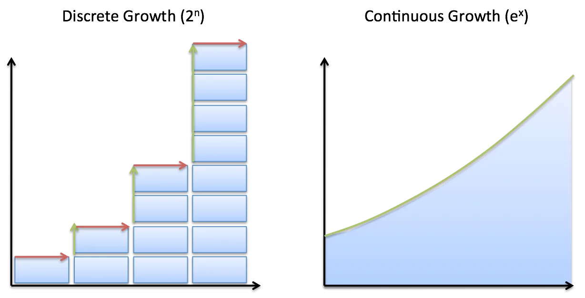
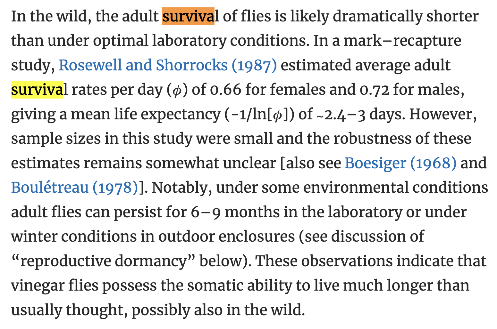

```{r setup, include=FALSE}
knitr::opts_chunk$set(echo = TRUE)
```

## Overview

There are two types of exponential growth models depending on whether time is measured in discrete time interval or continuous time unit. 




Upon proper transformation, these two could be converted into each other.


## Discrete growth

$x(t+1)-x(t)=rx(t) <=> x(t)=(1+r)^t*x(0)$

## Continuous growth

$dx/dt=kx <=> x(t) = Ce^{kt}$

## Link between the two

From the `discrete growth`, we have $\Delta(x)=x(t+1)-x(t)=rx(t)$, or in short $Delta(x)=rx$, where `r` is the growth rate.

$x(t) = x(0)*(1+r)^t =x*e^{ln(1+r)^t} = x(0)*e^{t*ln(1+r)}$

Now, differentiates both sides with time unit, `dt`, 

$dx(t)/dt = d(x*e^{t*ln(1+r)})/dt = ln(1+r) e^{t*ln(1+r)}*x(0)$

As, $e^{t*ln(1+r)}*x(0)$ is exactly $x(t)$, we have

$dx(t)/dt =  ln(1+r) x(t)$

Thus, $ln(1+r)$ ~ $k$ as in the first equation in this post, which means that if we take a discrete growth rate of `r`, it corresponds to a continuous growth rate of $ln(1+r)$. 

## Another way of derivation

As in discrete growth model, `r` is the growth rate in a time interval, for example, growth rate per year.

With `r` set at per year, `r/12` is per month, `r/12/4` is per week, `r/365` is per day.

In this line, if we divide time into infinite small intervals via `r/n` where n is pretty big, we approximates the `instanenous rate` in the continuous growth model.

After dividing time, how does the population growth equation change? 
With the same spirit as `(1+r)^t*x(0)`, the time interval becomes smaller and the number of time intervals become big. Divide time interval by n, the previous one time interval now becomes n pieces.
$(1+r/n)^n$

When {x->Inf}, we have
$\lim_{x->Inf} (1+r/n)^n = e^r$

Thus,
$x(t) = x(0)*(1+r)^t = x(0)*((1+r/n)^n)^t = x(0) * ((1+r/n)^{nt}) = x(0)*e^{rt}$

Therefore, $dx(t)/dt = r*e^{rt} = r*x(t)$, the continuous growth rate is r.

## Application in survival analysis: Finite and instantaneous rates

**Finite mortality rates**

Suppose we have a cohort of 100 animals, 10% of which die every month, which means the **finite mortality rate = 0.1**.

Over the full year, the yearly cumulative mortality is `1-(1-0.1)^{12}= 0.7175705`.

**Instantaneous rates**

With the above finite mortality rate, we could divide the time interval, in this case, 1 month, into many short time periods. 
Mathematically, using calculus, we have:

$Instantaneous\ mortality\ rate = ln (1.0 - finite\ mortality\ rate)$

Thus, in this example, 
`Instantaneous mortality rate = ln (1.0 - 0.1) = ln 0.9 = -0.105 per month`

As this is a **true rate**, and not a proportion, it can vary from -∞ to 0.

We can just multiply this value by 12 to give the yearly instantaneous mortality rate. Hence the yearly `instantaneous mortality rate = 12 x -0.105 = -1.26 per year`.

This can be converted to a finite rate using:

`Finite mortality rate = 1.0 - e^{instantaneous mortality rate}$ = 1-exp(-0.105*12) = 0.716`.

**Mean life expectancy**

Suppose we have survival rate per day 0.66, change it into finite mortality rate per day 1-0.66=0.34, then into instantaneous mortality rate ln(1-0.34), the mean life expectancy thus equals -1/instantaneous mortality rate = -1/ln(1-0.34) = 2.40 days.



 
## References
- https://betterexplained.com/articles/understanding-discrete-vs-continuous-growth/
- https://amsi.org.au/ESA_Senior_Years/SeniorTopic3/3e/3e_3links_1.html
- https://www.webpages.uidaho.edu/wlf448/Peterson2.htm
- https://influentialpoints.com/Training/finite-and-instantaneous_rates.htm
- [Flatt, Thomas. "Life-history evolution and the genetics of fitness components in Drosophila melanogaster." Genetics 214.1 (2020): 3-48.](https://academic.oup.com/genetics/article/214/1/3/5930441)

```{r}
sessionInfo()
```

