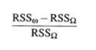
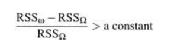
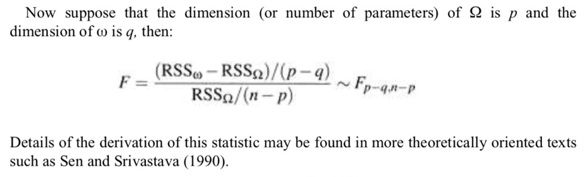
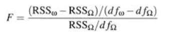
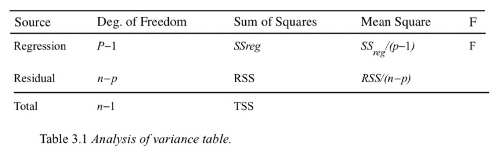

```{r setup, include=FALSE}
knitr::opts_chunk$set(echo = T,message = F,warning = F,
        fig.width=5,fig.height=5,cache = FALSE,
        #fig.show='hold',
        fig.align='center')
```


在阅读文献时候，常遇到一个lm （linear regression）后，紧跟就是一个anova。

linear regression和anova是什么关系呢？

不如直接看[一个例子](https://stats.stackexchange.com/questions/115304/interpreting-output-from-anova-when-using-lm-as-input).


```{r}
set.seed(897)    # this makes the example exactly reproducible
y     = c(rnorm(10, mean=0,   sd=1),
          rnorm(10, mean=-.5, sd=1),
          rnorm(10, mean=.5,  sd=1) )
g     = rep(c("A", "B", "C"), each=10)
model = lm(y~g)
summary(model)

anova(model)

```

上面这个pseudo-dataset，用lm和anova，得到的P value是一致的。


在[Linear Models With R](https://www.utstat.toronto.edu/~brunner/books/LinearModelsWithR.pdf) by Julian Faraway 这本书中，Chapter 3解释了anova和lm搅和在一起的是是非非。

首先是，在predictor是categorical data，response是numerical data的情况下，**拟合一个lm模型，就是在做一个统计检验hypothesis testing**.

- Anova test的是组与组之间是否有显著的差别， 是大家共享用一个mean，还是不同组别间mean的不同（用的是variance partition的方法）。如果mean不同，那么每个组别自己的mean是什么。
- 用lm来做估计不同组别各自mean的事情。然后找一个方法来test，一个grand mean好，还是一个组别一个mean好。

做lm后，会有一个量汇报出来，RSS，拟合模型所不能解释的变异有多少。可以想见，一个组别一个mean模型所不能解释的方差肯定比grand mean要小，毕竟参数多。
那么，w指的是小模型，即grand mean。Omega指的是大模型，即lm。


就会是一个蛮好的检验统计量test statistic，并且它一定是一个非负数。



如果这个统计量大于一定数值的话，就说明小模型能解释的东东太少了，或者大模型是在太强大了，能解释大部分数据的变异。那么就就拒绝小模型，接受大模型lm。

Anova的设计便是如此。



我们来算一个F统计量，大于一定数值之后，F分布的尾部面积就太小，那么就拒绝原假设，接受lm。

对于lm而言，


小模型自由度为dfw：n-1

大模型自由度为dfomega：n-p

所以dfw-dfomega = (n-1)-(n-p) = p-1



所以才经常会看到上面这种表格。
用的东西实际上是模型所不能解释的数据的变异性。
Source那一栏中，Regression是anova F统计量的分子,表示经过自由度矫正的两个模型所不能解释的残差的差别；Residual是分母，表示大模型所不能解释的残差的大小。


<!--more-->
