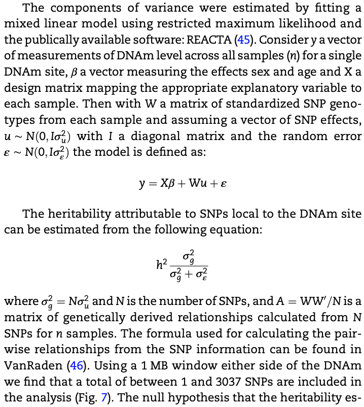

# heritable and heritability
- The term “heritable” applies to traits that vary in the population and are more similar in parents and offspring than they are in randomly selected individuals in the population.
- The concept of “heritability” was introduced “to quantify the level of predictability of passage of a biologically interesting phenotype from parent to offspring” (Feldman, 151). 

# heritability and population genetics

$V_{p} = V_{G} + V_{E} = V_{A} +V_{D} + V_{E}$

- broad sense heritability, h2b, “the proportion of phenotypic differences due to all sources of genetic variance” (Plomin 1990, 234). 
- Narrow sense heritability, h2, “the proportion of phenotypic variance due solely to additive genetic variance” (Plomin 1990, 234).

$h_{b}^2 = V_{G}/V_{P}$

$h^2 = V_{A}/V_{P}$

# measuring heritability: from galton to GWAS

## conventional methods don't rely on genetic data (genetic sequence, snps, etc)
A quantitative framework of family stuides, for example, 
$h^2=Vg/Vp ~ covariance(offspring, one parent)$

More details from [Heritability estimation](https://jyanglab.com/agro931/) from J.Yang Lab.

## genetic data combined with phenotype or endophenotype data

linear mixed model (LMM) framework

y = Xb + Zu + e

X: fixed effect

Z: random effect 

u ~ N(0, sigma1)
 
e ~ N(0, sigma2)
 
y: phenotype vector
 
Z: n x p matrix
 
n: number of samples
 
p: number of SNPs
 
element in Z: 0 ,1, 2 <=> aa, Aa, AA

Apply LMM to estimate sigma1 and sigma2

h2 = p\*sigma1 / (p\*sigma1+sigma2)

if using CpG (or metabolite or gene expression) as endo-phenotype, per CpG site heritability can be estimated. 

For example:

In one of my projects, I applied linear mixed model to estimate heritability in fruit fly (Using Drosophila to identify naturally occurring genetic modifiers of Aβ42- and tau-induced toxicity, PMID: 37311212, https://github.com/mingwhy/AD_fly_eye), 02_AD_fly_eye, `Caluclate best linear unbiased predictor (BLUP) and broadsense heritability (H2B)`.

## References
- [AGRO-932 Biometrical genetics and plant breeding](https://jyanglab.com/agro932/)
- [AGRO/ANSCI 931 Population Genetics](https://jyanglab.com/agro931/)
- [Stanford Encyclopedia of Philosophy](https://plato.stanford.edu/entries/heredity/)
- [Estimation of variance components and heritability](https://rpubs.com/jrut/853850)
- [昔时因，今日意](https://cosx.org/2014/04/lmm-and-me/) by 杨灿
- Yang, Jian, et al. "Common SNPs explain a large proportion of the heritability for human height." Nature genetics 42.7 (2010): 565-569.
- Shah, Sonia, et al. "Genetic and environmental exposures constrain epigenetic drift over the human life course." Genome research 24.11 (2014): 1725-1733.
- Rowlatt, Amy, et al. "The heritability and patterns of DNA methylation in normal human colorectum." Human molecular genetics 25.12 (2016): 2600-2611.
- Rohde, Palle Duun, Izel Fourie Sørensen, and Peter Sørensen. "qgg: an R package for large-scale quantitative genetic analyses." Bioinformatics 36.8 (2020): 2614-2615.
- Zhu, Huanhuan, and Xiang Zhou. "Statistical methods for SNP heritability estimation and partition: A review." Computational and Structural Biotechnology Journal 18 (2020): 1557-1568.

