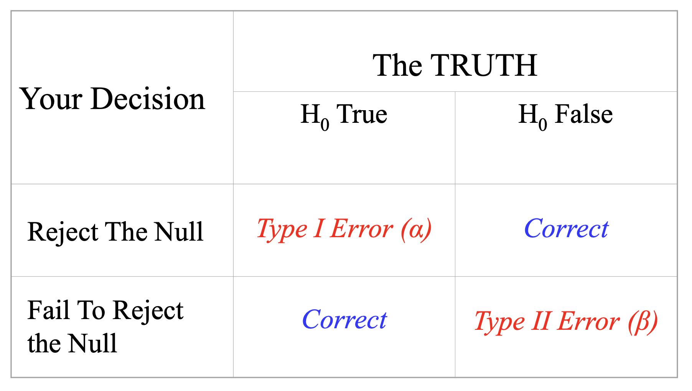
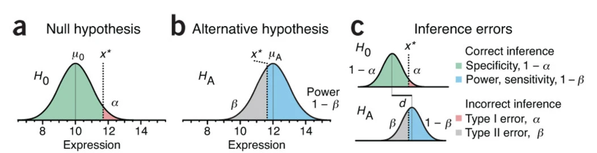
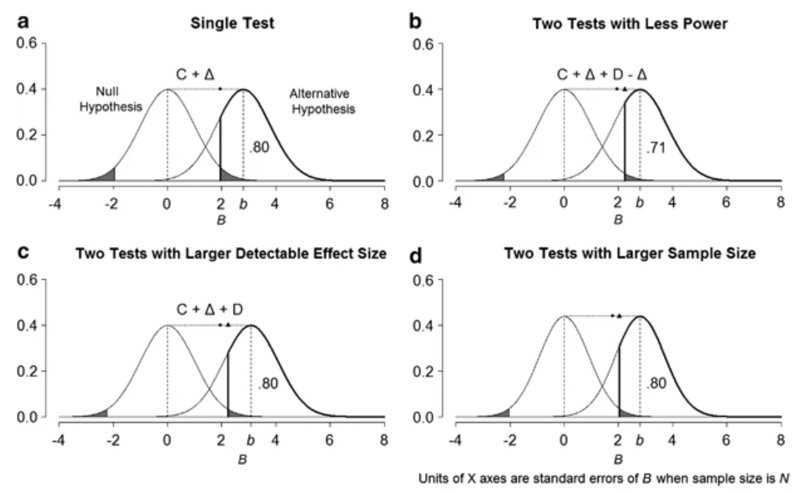

# Hypothesis Testing 
1. Define a null hypothesis, often “No Difference”
2. Define your alpha level, or what would be considered evidence that the observed phenomenon was inconsistent with the null hypothesis
3. Obtain data and conduct the analysis

# Statistical Power
The probability of correctly rejecting the Null Hypothesis, which depends on

- sample size
- effect size
- the alpha level
- the beta level

# Cost of large numbers of hypothesis tests
why multiple testing inevitably leads to some loss of power or the need for a compensatory increase in the detectable effect size and/or sample size?

## single test
Consider a hypothesis test based on a statistic B, such that the standardized z-statistic, $Z = (B-b)/(s/\sqrt(N))$, where b is the expected value of B and  is its standard error in a sample of size N.

if we want to test whether is expected value $b = 0$.
Set $\alpha = 0.05$, the critical value $C = 1.96$, we would rejected the null hypothesis if B is more than 1.96 standard errors from 0.

Set effect size $b = 2.8$, which means in the alternative hypothesis, statistic B follows $N(b,s/\sqrt(N))$, then we got 80% power (area under the bold curve on the rightside in Figure 1a).

## two tests
When performing this test twice, or H=2, and we choose a conservative approach, Bonferroni adjustment, to correct for multiple testing.

This  approach sets the per-test significance level to $\alpha/H$, which guarantees for an experiment comprised of H tests, the probability of one or more false positives (known as the family-wise error rate) is no more than $\alpha$. 
For  $\alpha = 0.05, H=2$, the Bonferroni critical value C is 2.24. This led to a power at 71%  (area under the bold curve on the rightside in Figure 1b).

Thus, the cost of going from a single test with 80% power to two Bonferroni-adjusted tests is always a reduction of power to 71% if the initial effect size and sample size are maintained. 

## larger effect size or increase sample size
How to maintain the the original level of power?
Either we have a larger detectable effect size (Figure 1c), or increase the sample size.
A larger detectable effect size means the statistic's distribution under the alternative hypothesis shifted to the rightside.
Increasing sample size would narrow the widths of both the null and alternative curves accordingly (Figure 1d). 

### References
- [Hypothesis Testing, Effect Sizes and Statistical Power](https://www.colorado.edu/ibg/sites/default/files/attached-files/boulder_power_2022.pdf) by Brad Verhulst from Texas A&M University
- Krzywinski, M., Altman, N. Power and sample size. Nat Methods 10, 1139–1140 (2013). https://doi.org/10.1038/nmeth.2738
3, 
- Lazzeroni, L., Ray, A. The cost of large numbers of hypothesis tests on power, effect size and sample size. Mol Psychiatry 17, 108–114 (2012). https://doi.org/10.1038/mp.2010.117

