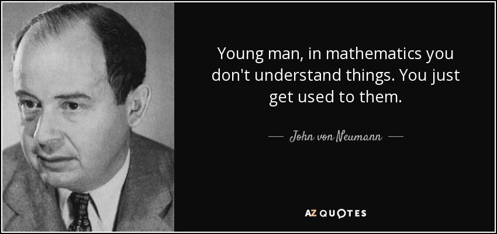
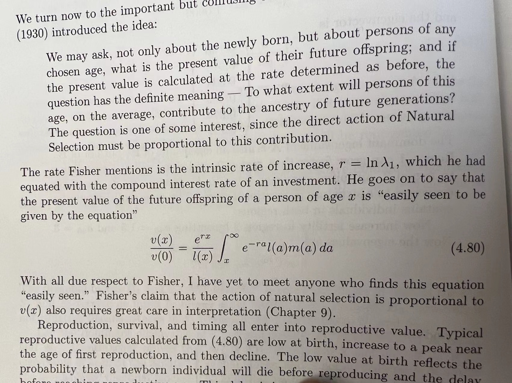

John Von Neumann once said to Felix Smith
“Young man, in mathematics you don't understand things. You just get used to them.”

在知乎上看到这个问题：[数学和物理超出直觉范围后改怎么学习？](https://www.zhihu.com/question/49046240/answer/137175780)

最近在嗑 数量遗传学，久违的被数学摁在地上虐。

因为phd训练背景是群体遗传学，在生物的不同方向中算是数理性比较强的了。跟遗传漂变、自然选择、迁移、重组如何改变基因频率这件事较了六年劲儿之后，我愉快的进了数量遗传学的坑。

也不是因为闲来无聊喜欢作弄自己，大规模测序出来之前，生物这个领域，复杂性状的研究不就是靠数量遗传学嘛，从高尔顿画父母和孩子的身高分布的散点图，从此回归分析有了名字，到我现在的研究领域，lifespan和healthspan，你要说性状，量啥的都有，还都能量的是age-specific的effect。

如果说，以前做物种形成或者物种适应性演化，就盯着一个性状猛看，耐盐啦，开花啦，唱歌啦，求偶啦，做模拟的基本时间单位是”世代“，from generation to generation simulation of gene frequency dynamics。 现在看ageing，无可避免的是需要把一个generation切分成不同的age cohort：toddler，child，young，old，盯着一个一个cohort看，一次还得看好几个性状：谁知道啥性状就影响到fertility和mortality了呢？谁知道你晚年的生活质量是不是被年轻时候的作妖各种拿捏呢？

Russell Lande 真的诚不我欺... 当初做物种形成被他的sexual selection模型虐，现在看aging，被他的correlated selection模型继续虐。

想起看 Hal Caswell 大佬写的书 《Matrix Population Models》，里面忍不住吐槽Fisher：
“With all due respect to fisher, I have yet to meet anyone who finds this equation “easily seen”.’

大佬们也有跟不上前人节奏的时候呀~

于是，每次我在这些闪闪发光的公式面前郁闷自己任督二脉不知哪里出bug的时候，我就会quote计算机科学之父冯·诺伊曼的话来自我安慰~ 看着呗，说不定啥时候就通了呢~ 万一再一通则灵了呢~ 说不定也就不是个啥事了嘛~

